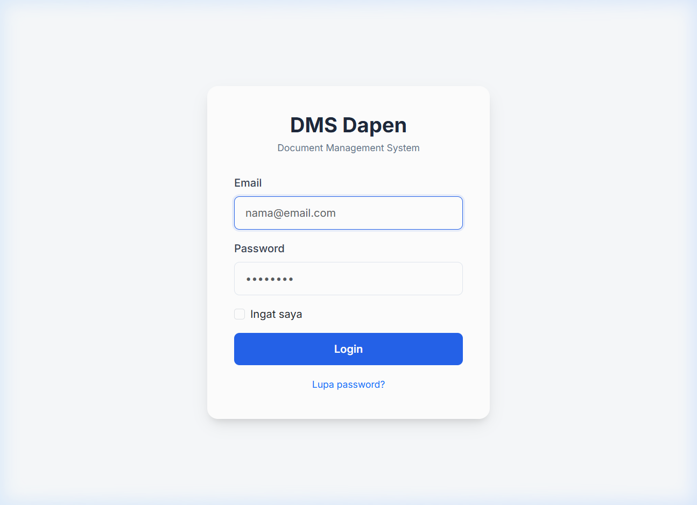
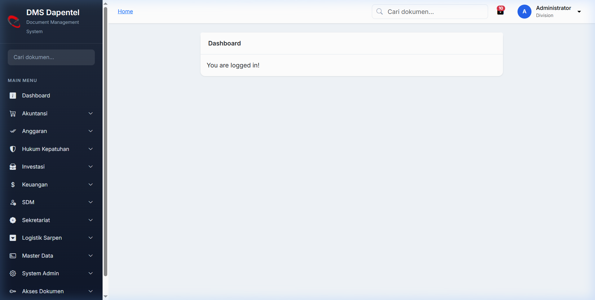
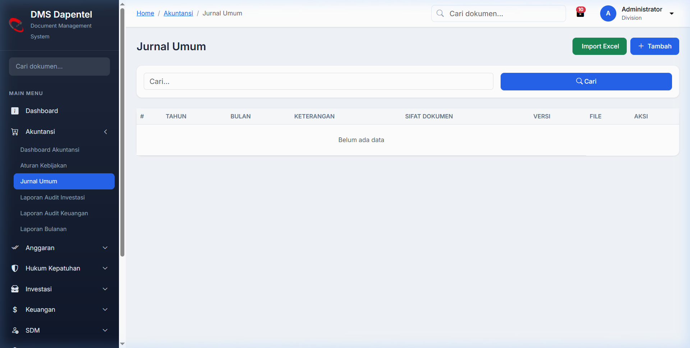

# Panduan Penggunaan Aplikasi (DMS)

## Daftar Isi

1. [Pendahuluan](#pendahuluan)
2. [Akses Sistem & Autentikasi](#akses-sistem--autentikasi)
3. [Dashboard](#dashboard)
4. [Manajemen Dokumen (Modul Utama)](#manajemen-dokumen-modul-utama)
5. [Fitur Pencarian & Akses Dokumen](#fitur-pencarian--akses-dokumen)
6. [Manajemen Akun & Profil Ku](#manajemen-akun--profil-ku)
7. [Administrator Sistem](#administrator-sistem)

---

## 1. Pendahuluan

Aplikasi Document Management System (DMS) ini dirancang untuk memudahkan pengelolaan, penyimpanan, pencarian, dan pendistribusian dokumen secara elektronik di berbagai divisi/departemen (seperti: Akuntansi, Anggaran, SDM, Keuangan, dll).

## 2. Akses Sistem & Autentikasi

### Login

1. Buka halaman utama aplikasi di browser Anda.
   
2. Masukkan kombinasi **Email/Username** dan **Password** Anda.
3. Klik tombol **Login**.

### Keluar (Logout)

1. Klik pada nama/profil Anda di sudut kanan atas layar.
2. Pilih menu **Logout**.

---

## 3. Dashboard

Setelah berhasil masuk, Anda akan diarahkan ke halaman **Dashboard**. Halaman ini menampilkan ringkasan dokumen dan akses cepat ke beberapa fitur utama.

Terdapat juga **Dashboard per Modul** (misalnya Dashboard Akuntansi, Dashboard SDM, dll) yang menampilkan statistik spesifik untuk dokumen di ranah modul tersebut.

---

## 4. Manajemen Dokumen (Modul Utama)

Setiap modul divisi memiliki struktur menu yang memungkinkan pengguna untuk mengelola dokumen mereka.

### Modul Tersedia

- **Akuntansi:** Aturan Kebijakan, Jurnal Umum, Laporan Audit, Laporan Bulanan, dll.
- **Anggaran:** Dokumen RRA, Laporan PRBC, Rencana Kerja, dll.
- **Hukum Kepatuhan:** Kajian Hukum, Legal Memo, Regulasi Internal/Eksternal, Kontrak, dll.
- **Investasi:** Transaksi, Surat, Perencanaan, Propensa.
- **Keuangan:** Surat Bayar, SPB, SPPB, Cashflow, Penempatan, Pajak, Pemindahbukuan.
- **SDM:** Peraturan, Surat Masuk/Keluar, Rekrut Masuk, Promosi Mutasi, Naik Gaji, dll.
- **Sekretariat:** Risalah Rapat, Materi, Laporan, Surat, Pengadaan.
- **Logistik Sarpen:** Procurement, Keamanan, Kendaraan, SMK3, Polis Asuransi, dll.

### Aksi Standar pada Setiap Dokumen (Sub-Modul)

Pada setiap halaman sub-modul (contoh: _Jurnal Umum_ pada divisi _Akuntansi_), Anda dapat melakukan aksi berikut:

1. **Tambah Dokumen:** Klik tombol _Tambah_ atau _Upload Baru_ untuk mengunggah dokumen tunggal, mengisi metadata (seperti nomor, tanggal, status), dan menyimpan data.
2. **Lihat/Preview Dokumen:** Klik ikon _Preview_ untuk melihat isi dokumen langsung dari browser Anda tanpa harus mengunduhnya.
3. **Unduh Dokumen:** Klik ikon _Download_ untuk mengunduh salinan dokumen ke komputer Anda.
4. **Import Data:** Anda dapat menggunakan fitur **Import Excel** untuk mengunggah banyak rekam jejak sekaligus. Gunakan **Download Template** terlebih dahulu untuk mendapatkan format kolom yang benar.
5. **Manajemen Tag:** Tag (label) dapat ditambahkan ke dalam dokumen untuk mempermudah pencarian maupun pengelompokan.

---

## 5. Fitur Pencarian & Akses Dokumen

Aplikasi ini menerapkan konsep Hak Akses Berbasis Pengguna (RBAC). Anda hanya bisa melihat sebagian dokumen sesuai jenjang maupun peran Anda.

- **Global Search (Pencarian Global):** Fitur penelusuran dokumen di seluruh modul. Anda bisa mencari dokumen berdasarkan nama, nomor surat, kata kunci (tag), atau modul.
- **Permintaan Akses (Request Access):** Jika Anda menemukan dokumen melalui pencarian namun dokumen tersebut tidak memiliki izin akses penuh untuk Anda, Anda dapat mengklik fitur **"Request Access"**.
- **Permintaan Saya (My Requests):** Di menu ini, Anda bisa melihat riwayat daftar dokumen yang telah Anda minta hak akses-nya, dan memantau status persetujuan dari Admin (Pending/Approved/Rejected).
- **Dokumen Saya (My Documents):** Menampilkan daftar dokumen yang aksesnya telah disetujui (Approved) khusus untuk Anda, yang sebelumnya mungkin tidak dapat diakses.

---

## 6. Manajemen Akun & Profil Ku

Pada profil, Anda dapat mengubah data diri serta memperbarui kata sandi Anda.

1. Klik pada profil Anda di kanan atas layar, pilih **Profile**.
2. **Ubah Informasi:** Sesuaikan Nama, Email (jika ada izin).
3. **Ganti Password:** Masukkan _Current Password_, lalu _New Password_ dan konfirmasi. Klik Simpan.

---

## 7. Administrator Sistem (Hanya untuk Admin)

Menu berikut hanya muncul untuk pengguna dengan level admin (System Admin/Super Admin):

- **Master Data:** Menambah dan mengelola daftar _Divisi_, _Departemen_, dan _Jabatan_.
- **Manajemen User:** Membuat akun pengguna baru, menentukan Jabatan/Divisi, mengatur Role/Peran sistem.
- **Manajemen Role & Menu:** Menyatukan hak istimewa (privileges) pengguna dan menu mana saja yang boleh mereka buka.
- **Akses Dokumen (Approval):** Ketika user biasa melakukan _request access_ untuk suatu dokumen, Admin divisi / Super Admin akan memberikan persetujuan (Approve) atau Penolakan (Reject) melalui halaman _Document Assignment/Access_.
